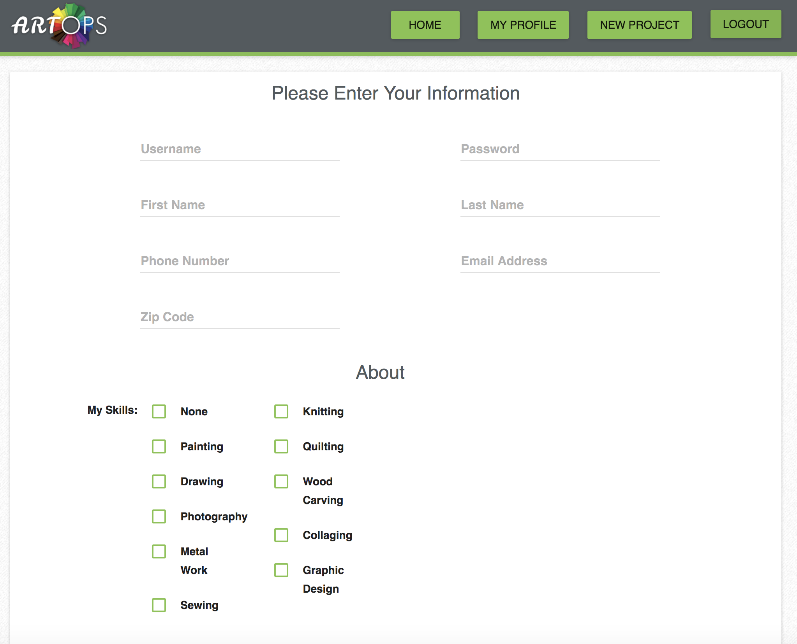
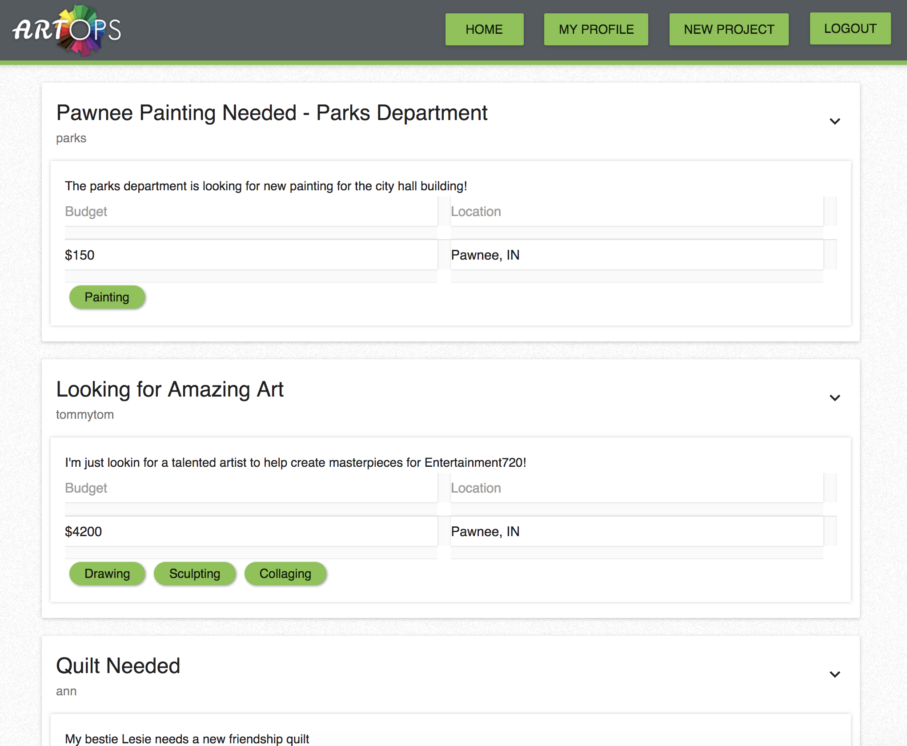

ARTOPS (http://artops.surge.sh/) is an application designed to connect people looking for custom art with artists in their local area. Users can post a new project that they are looking for and artists can respond if they are interested in providing the work. Each user creates a profile that includes their locaiton, artistic skills, and a link to their personal website to show their work.

This was a Galvanize Q3 Group Project where we created an application in an unfamiliar environment. Our team chose to learn React as a new front-end framework. 

The home page gives users information about the site. Existing users can log into their account here.

New users can register for an account by clicking on 'Register Here':

Once logged in, users are shown their feed of current projects:

They can click on the dropdown arrow on each post to view and add comments:

Users can update their profile: 

Users can also create a new post if they are looking for art:

Contributors: Anna Mefford, Cassie Peterson, Evan Busse, Heidi Rodriguez, and Matt Pestridge.

This project was bootstrapped with [Create React App](https://github.com/facebookincubator/create-react-app).
